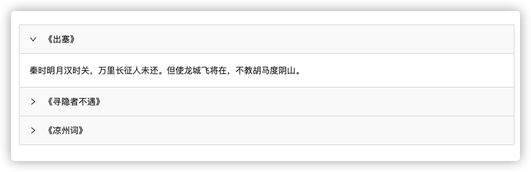

<h1 align="center">react-schema-render</h1>


## Introduction

`react-schema-render` 是一个通用型 schema 转 React 组件的工具组件。其遵守 [Schema To React](https://dream2023.gitee.io/react-schema-render/规范) 规范。

## Feature

- 体积小：仅 3kb；
- 功能强：支持数组解析、深度嵌套、混合渲染等；
- 扩展性高：支持自定义解析器、装饰器；
- 侵入性低：无需对已有组件做任何更改即可接入；
- 稳定性高：测试覆盖率 100%。

## Quick Started

**第 1 步：安装**

```bash
yarn add react-schema-render # npm install react-schema-render -S
```

**第 2 步：建立组件映射关系**

我们以 `ant-design` 的 [carousel](https://ant.design/components/carousel-cn/) 作为示例（只是为了好看，其和具体的 UI 库**无关**）。

```bash
# yarn add antd
```

```js
import { Collapse } from 'antd';
const { Panel } = Collapse;

const components = {
  collapse: Collapse,
  panel: Panel,
};
```

**第 3 步：传递映射关系**

```js
import { setComponents } from 'react-schema-render';
setComponents(components);
```

**第 4 步：定义 schema**

```jsx
const schema = {
  // component 代表组件
  component: 'collapse',
  // 其他属性为 component 对应的属性
  defaultActiveKey: ['1'],
  // children 支持深度嵌套
  children: [
    {
      component: 'panel',
      header: '《出塞》',
      key: '1',
      // children 为字符串
      children:
        '秦时明月汉时关，万里长征人未还。但使龙城飞将在，不教胡马度阴山。',
    },
    {
      component: 'panel',
      header: '《寻隐者不遇》',
      key: '2',
      // children 为 jsx
      children: (
        <>
          <p>松下问童子，言师采药去。</p>
          <p>只在此山中，云深不知处。</p>
        </>
      ),
    },
    {
      component: 'panel',
      header: '《凉州词》',
      key: '3',
      // children 为 schema 数组
      children: [
        {
          component: 'p',
          key: 1,
          children: '葡萄美酒夜光杯，欲饮琵琶马上催。',
        },
        {
          component: 'p',
          key: 2,
          children: '醉卧沙场君莫笑，古来征战几人回？',
        },
      ],
    },
  ],
};
```

**第 5 步：使用**

```js
import { SchemaRender } from 'react-schema-render';

<SchemaRender schema={schema}></SchemaRender>;
```

完成 Demo：

```jsx
import React from 'react';
import { Collapse } from 'antd';
import { setComponents, SchemaRender } from 'react-schema-render';

const { Panel } = Collapse;
const components = {
  collapse: Collapse,
  panel: Panel,
};

setComponents(components);

const App = () => {
  const schema = {
    component: 'collapse',
    defaultActiveKey: ['1'],
    children: [
      {
        component: 'panel',
        header: '《出塞》',
        key: '1',
        // children 为字符串
        children:
          '秦时明月汉时关，万里长征人未还。但使龙城飞将在，不教胡马度阴山。',
      },
      {
        component: 'panel',
        header: '《寻隐者不遇》',
        key: '2',
        // children 为 jsx
        children: (
          <>
            <p>松下问童子，言师采药去。</p>
            <p>只在此山中，云深不知处。</p>
          </>
        ),
      },
      {
        component: 'panel',
        header: '《凉州词》',
        key: '3',
        // children 为 schema 数组
        children: [
          {
            component: 'p',
            key: 1,
            children: '葡萄美酒夜光杯，欲饮琵琶马上催。',
          },
          {
            component: 'p',
            key: 2,
            children: '醉卧沙场君莫笑，古来征战几人回？',
          },
        ],
      },
    ],
  };

  return <SchemaRender schema={schema}></SchemaRender>;
};

export default App;
```

[](https://dream2023.gitee.io/react-schema-render/)

## Docs & Demo

更多功能演示和 API 说明，请参见文档：

[https://dream2023.gitee.io/react-schema-render](https://dream2023.gitee.io/react-schema-render)
